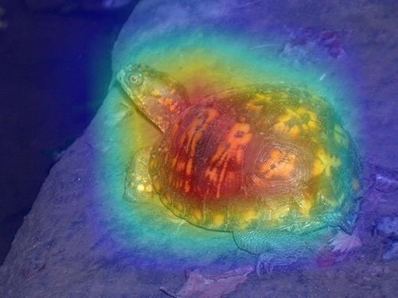

# Overview
The `Tensorflow` implementation of [Eigen-CAM](https://paperswithcode.com/paper/ablation-cam-visual-explanations-for-deep)

# Example



# Usage
- The example image is generate from mobilenetv2:  
```
python show.py -d cpu -img assets/n01669191_46.JPEG -layer out_relu -speedup
```

- for custom model  
model path is a `saved model` folder path including `keras_metadata.pb`.
```
python show.py -d cpu -img assets/n01669191_46.JPEG -layer {layer name} -m {your model path} -speedup
```
- Get predict label  
  My program will print the predict label, you can refer to `show.py`.  
  For imagenet label to class name, you can refer to [class id to name](https://gist.github.com/yrevar/942d3a0ac09ec9e5eb3a).
  
# Note
- Remenber to check whether the image preprocess is the same as yours, if not, you should alert the preprocess in the `show.py` or the result will be wrong.
- If you have cuda, you can just replace the "cpu" to "cuda". 
- Generally, the layer is deeper, the interpretaton is better. Accordingly, using the last layer before last global average layer to plot heatmap would be a nice choice.
- add command parameter `-speedup` will plot heatmap much faster, however, it is memory-expensive, that is, it is a trade off. If the memory is exhausted, you should don't add this parameter in command line. 

# Other inplementation of CAM method
| Method   | Framework |
| :-----:  | :--------: |
| [Grad-CAM](https://github.com/shyhyawJou/GradCAM-pytorch) | Pytorch | 
| [Eigen-CAM](https://github.com/shyhyawJou/EigenCAM-Pytorch) | Pytorch |
